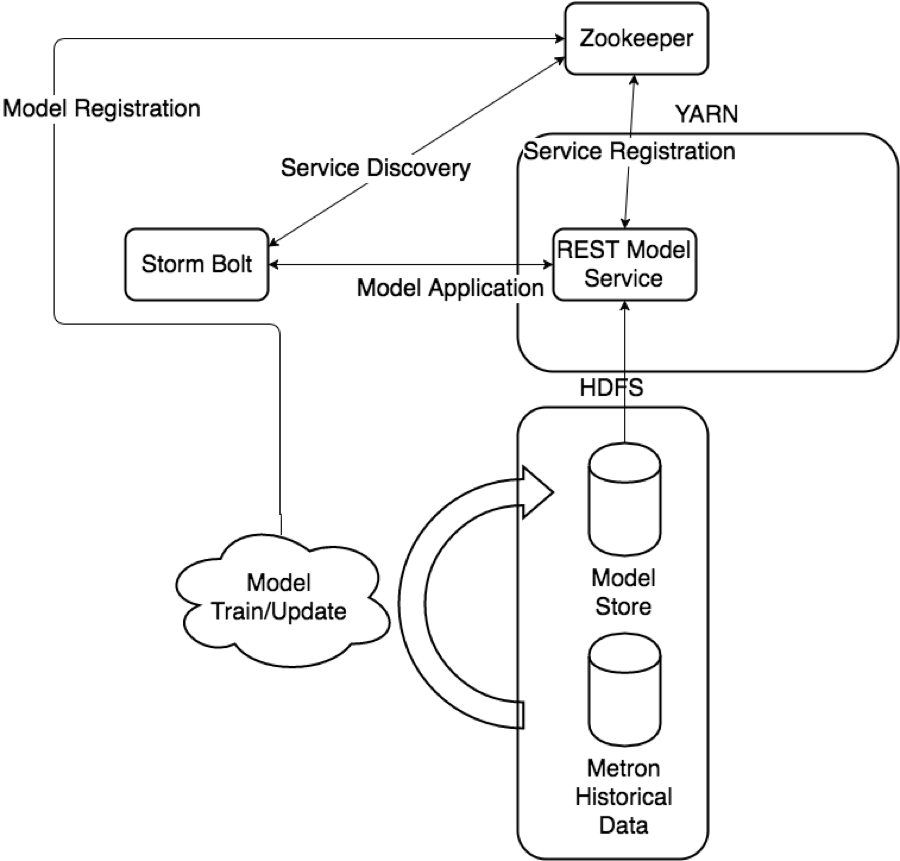

# Model Management Infrastructure

#Introduction

One of the main features envisioned and requested is the ability to augment the threat intelligence and enrichment processes with insights derived from machine learning or statistical models.  The challenges with this sort of infrastructure are
* Applying the model may be sufficiently computationally/resource intensive that we need to support scaling via load balancing, which will require service discovery and management.
* Models require out of band and frequent training to react to growing threats and new patterns that emerge.
* Models should be language/environment agnostic as much as possible.  These should include small-data and big-data libraries and languages.

To support a high throughput environment that is manageable, it is evident that 
* Multiple versions of models will need to be exposed
* Deployment should happen using Yarn to manage resources
* Clients should have new model endpoints pushed to them

##Architecture

To support these requirements, the following components have been created:
* A Yarn application which will listen for model deployment requests and upon execution, register their endpoints in zookeeper:
  * Operation type: ADD, REMOVE, LIST
  * Model Name
  * Model Version
  * Memory requirements (in megabytes)
  * Number of instances
* A command line deployment client which will localize the model payload onto HDFS and submit a model request
* A Java client which will interact with zookeeper and receive updates about model state changes (new deployments, removals, etc.)
* A series of Stellar functions for interacting with models deployed via the Model as a Service infrastructure.

## `maas_service.sh`

## `maas_deploy.sh`

## Example
