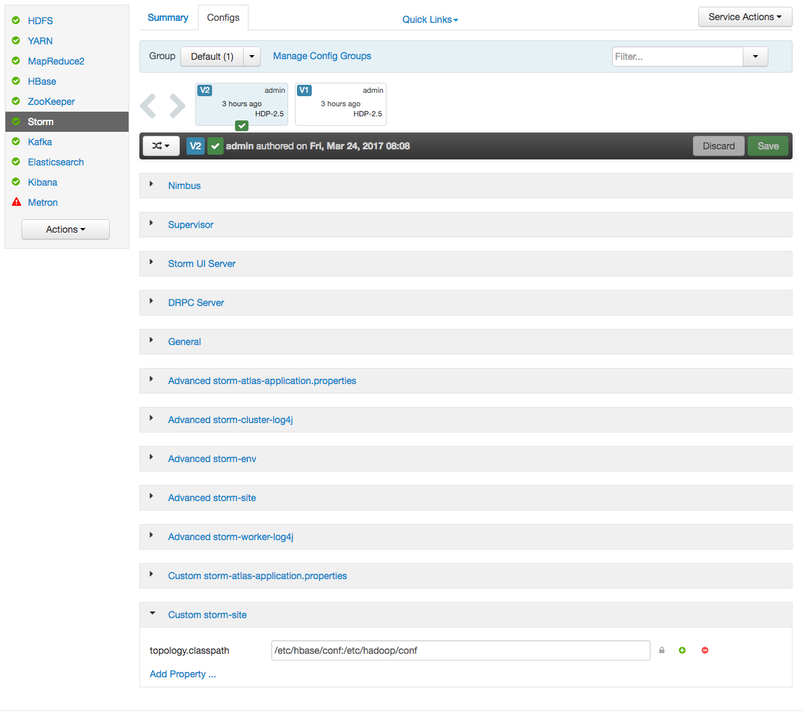
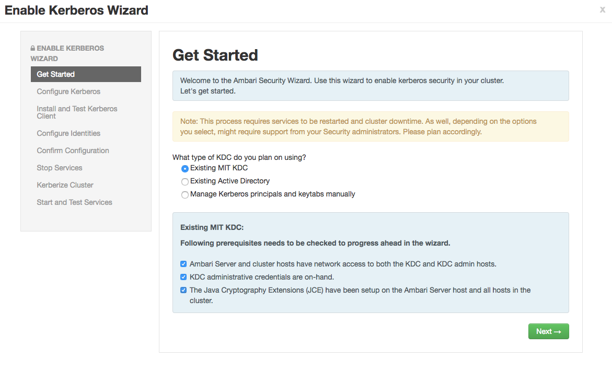

# Setting Up Kerberos outside of an Ambari Management Pack
The Ambari Management pack will manage Kerberization when used.
**Note:** These are instructions for Kerberizing Metron Storm topologies from Kafka to Kafka. This does not cover the sensor connections or MAAS.
General Kerberization notes can be found in the metron-deployment [README.md](README.md)

## Setup the KDC
See [Setup the KDC](vagrant/Kerberos-setup.md)

4. Setup the admin and metron user principals. You'll kinit as the metron user when running topologies. Make sure to remember the passwords.
    ```
    kadmin.local -q "addprinc admin/admin"
    kadmin.local -q "addprinc metron"
    ```

## Kerberize Metron

1. Stop all topologies - we will  restart them again once Kerberos has been enabled.
    ```
    for topology in bro snort enrichment indexing; do storm kill $topology; done
    ```

2. Create the metron user HDFS home directory
    ```
    sudo -u hdfs hdfs dfs -mkdir /user/metron && \
    sudo -u hdfs hdfs dfs -chown metron:hdfs /user/metron && \
    sudo -u hdfs hdfs dfs -chmod 770 /user/metron
    ```

3. In [Ambari](http://node1:8080), setup Storm to run with Kerberos and run worker jobs as the submitting user:

    a. Add the following properties to custom storm-site:
    ```
    topology.auto-credentials=['org.apache.storm.security.auth.kerberos.AutoTGT']
    nimbus.credential.renewers.classes=['org.apache.storm.security.auth.kerberos.AutoTGT']
    supervisor.run.worker.as.user=true
    ```

    b. In the Storm config section in Ambari, choose “Add Property” under custom storm-site:

    

    c. In the dialog window, choose the “bulk property add mode” toggle button and add the below values:

    

4. Kerberize the cluster via Ambari. More detailed documentation can be found [here](http://docs.hortonworks.com/HDPDocuments/HDP2/HDP-2.5.3/bk_security/content/_enabling_kerberos_security_in_ambari.html).

    a. For this exercise, choose existing MIT KDC (this is what we setup and installed in the previous steps.)

    

    

    b. Setup Kerberos configuration. Realm is EXAMPLE.COM. The admin principal will end up as admin/admin@EXAMPLE.COM when testing the KDC. Use the password you entered during the step for adding the admin principal.

    

    c. Click through to “Start and Test Services.” Let the cluster spin up, but don't worry about starting up Metron via Ambari - we're going to run the parsers manually against the rest of the Hadoop cluster Kerberized. The wizard will fail at starting Metron, but this is OK. Click “continue.” When you’re finished, the custom storm-site should look similar to the following:

    

5. Setup Metron keytab
    ```
    kadmin.local -q "ktadd -k metron.headless.keytab metron@EXAMPLE.COM" && \
    cp metron.headless.keytab /etc/security/keytabs && \
    chown metron:hadoop /etc/security/keytabs/metron.headless.keytab && \
    chmod 440 /etc/security/keytabs/metron.headless.keytab
    ```

6. Kinit with the metron user
    ```
    kinit -kt /etc/security/keytabs/metron.headless.keytab metron@EXAMPLE.COM
    ```

7. First create any additional Kafka topics you will need. We need to create the topics before adding the required ACLs. The current full dev installation will deploy bro, snort, enrichments, and indexing only. e.g.
    ```
    ${HDP_HOME}/kafka-broker/bin/kafka-topics.sh --zookeeper ${ZOOKEEPER}:2181 --create --topic yaf --partitions 1 --replication-factor 1
    ```

8. Setup Kafka ACLs for the topics
    ```
    export KERB_USER=metron
    for topic in bro enrichments indexing snort; do
        ${HDP_HOME}/kafka-broker/bin/kafka-acls.sh --authorizer kafka.security.auth.SimpleAclAuthorizer --authorizer-properties zookeeper.connect=${ZOOKEEPER}:2181 --add --allow-principal User:${KERB_USER} --topic ${topic}
    done
    ```

9. Setup Kafka ACLs for the consumer groups
    ```
    ${HDP_HOME}/kafka-broker/bin/kafka-acls.sh --authorizer kafka.security.auth.SimpleAclAuthorizer --authorizer-properties zookeeper.connect=${ZOOKEEPER}:2181 --add --allow-principal User:${KERB_USER} --group bro_parser
    ${HDP_HOME}/kafka-broker/bin/kafka-acls.sh --authorizer kafka.security.auth.SimpleAclAuthorizer --authorizer-properties zookeeper.connect=${ZOOKEEPER}:2181 --add --allow-principal User:${KERB_USER} --group snort_parser
    ${HDP_HOME}/kafka-broker/bin/kafka-acls.sh --authorizer kafka.security.auth.SimpleAclAuthorizer --authorizer-properties zookeeper.connect=${ZOOKEEPER}:2181 --add --allow-principal User:${KERB_USER} --group yaf_parser
    ${HDP_HOME}/kafka-broker/bin/kafka-acls.sh --authorizer kafka.security.auth.SimpleAclAuthorizer --authorizer-properties zookeeper.connect=${ZOOKEEPER}:2181 --add --allow-principal User:${KERB_USER} --group enrichments
    ${HDP_HOME}/kafka-broker/bin/kafka-acls.sh --authorizer kafka.security.auth.SimpleAclAuthorizer --authorizer-properties zookeeper.connect=${ZOOKEEPER}:2181 --add --allow-principal User:${KERB_USER} --group indexing
    ```

10. Add metron user to the Kafka cluster ACL
    ```
    ${HDP_HOME}/kafka-broker/bin/kafka-acls.sh --authorizer kafka.security.auth.SimpleAclAuthorizer --authorizer-properties zookeeper.connect=${ZOOKEEPER}:2181 --add --allow-principal User:${KERB_USER} --cluster kafka-cluster
    ```

11. We also need to grant permissions to the HBase tables. Kinit as the hbase user and add ACLs for metron.
    ```
    kinit -kt /etc/security/keytabs/hbase.headless.keytab hbase-metron_cluster@EXAMPLE.COM
    echo "grant 'metron', 'RW', 'threatintel'" | hbase shell
    echo "grant 'metron', 'RW', 'enrichment'" | hbase shell
    ```

12. Create a “.storm” directory in the metron user’s home directory and switch to that directory.
    ```
    su metron
    mkdir ~/.storm
    cd ~/.storm
    ```

13. Create a custom client jaas file. This should look identical to the Storm client jaas file located in /etc/storm/conf/client_jaas.conf except for the addition of a Client stanza. The Client stanza is used for Zookeeper. All quotes and semicolons are necessary.
    ```
    cat << EOF > client_jaas.conf
    StormClient {
        com.sun.security.auth.module.Krb5LoginModule required
        useTicketCache=true
        renewTicket=true
        serviceName="nimbus";
    };
    Client {
        com.sun.security.auth.module.Krb5LoginModule required
        useKeyTab=true
        keyTab="/etc/security/keytabs/metron.headless.keytab"
        storeKey=true
        useTicketCache=false
        serviceName="zookeeper"
        principal="metron@EXAMPLE.COM";
    };
    KafkaClient {
        com.sun.security.auth.module.Krb5LoginModule required
        useKeyTab=true
        keyTab="/etc/security/keytabs/metron.headless.keytab"
        storeKey=true
        useTicketCache=false
        serviceName="kafka"
        principal="metron@EXAMPLE.COM";
    };
    EOF
    ```

14. Create a storm.yaml with jaas file info. Set the array of nimbus hosts accordingly.
    ```
    cat << EOF > storm.yaml
    nimbus.seeds : ['node1']
    java.security.auth.login.config : '/home/metron/.storm/client_jaas.conf'
    storm.thrift.transport : 'org.apache.storm.security.auth.kerberos.KerberosSaslTransportPlugin'
    EOF
    ```

15. Create an auxiliary storm configuration json file in the metron user’s home directory. Note the login config option in the file points to our custom client_jaas.conf.
    ```
    cat << EOF > ~/storm-config.json
    {
        "topology.worker.childopts" : "-Djava.security.auth.login.config=/home/metron/.storm/client_jaas.conf"
    }
    EOF
    ```

16. Setup enrichment and indexing.

    a. Modify enrichment.properties as root located at `${METRON_HOME}/config/enrichment.properties`
    ```
    if [[ $EUID -ne 0 ]]; then
        echo -e "\nERROR:\tYou must be root to run these commands.  You may need to type exit."
    else
        sed -i 's/kafka.security.protocol=.*/kafka.security.protocol=PLAINTEXTSASL/' ${METRON_HOME}/config/enrichment.properties
        sed -i 's/topology.worker.childopts=.*/topology.worker.childopts=-Djava.security.auth.login.config=\/home\/metron\/.storm\/client_jaas.conf/' ${METRON_HOME}/config/enrichment.properties
    fi
    ```

    b. Modify elasticsearch.properties as root located at `${METRON_HOME}/config/elasticsearch.properties`
    ```
    if [[ $EUID -ne 0 ]]; then
        echo -e "\nERROR:\tYou must be root to run these commands.  You may need to type exit."
    else
        sed -i 's/kafka.security.protocol=.*/kafka.security.protocol=PLAINTEXTSASL/' ${METRON_HOME}/config/elasticsearch.properties
        sed -i 's/topology.worker.childopts=.*/topology.worker.childopts=-Djava.security.auth.login.config=\/home\/metron\/.storm\/client_jaas.conf/' ${METRON_HOME}/config/elasticsearch.properties
    fi
    ```

17. Distribute the custom jaas file and the keytab to each supervisor node, in the same locations as above. This ensures that the worker nodes can authenticate.  For a one node cluster, nothing needs to be done.

18. Kinit with the metron user again
    ```
    su metron
    cd
    kinit -kt /etc/security/keytabs/metron.headless.keytab metron@EXAMPLE.COM
    ```

19. Restart the parser topologies. Be sure to pass in the new parameter, “-ksp” or “--kafka_security_protocol.” Run this from the metron home directory.
    ```
    for parser in bro snort; do
        ${METRON_HOME}/bin/start_parser_topology.sh -z ${ZOOKEEPER}:2181 -s ${parser} -ksp SASL_PLAINTEXT -e storm-config.json
    done
    ```

20. Now restart the enrichment and indexing topologies.
    ```
    ${METRON_HOME}/bin/start_enrichment_topology.sh
    ${METRON_HOME}/bin/start_elasticsearch_topology.sh
    ```

Metron should be ready to receieve data.

## Push Data
See [Push Data](vagrant/Kerberos-setup.md)

### Other useful commands
See [Other useful commands](vagrant/Kerberos-setup.md)

#### References
* [https://github.com/apache/storm/blob/master/SECURITY.md](https://github.com/apache/storm/blob/master/SECURITY.md)
