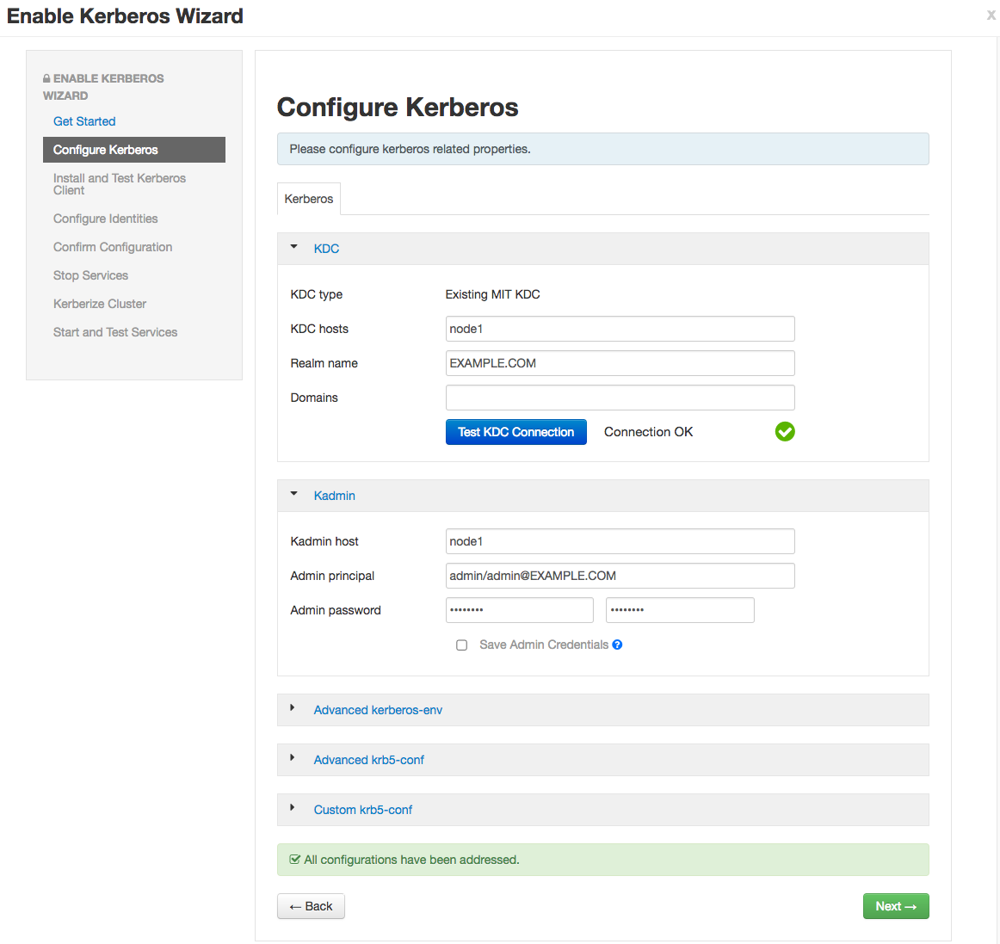
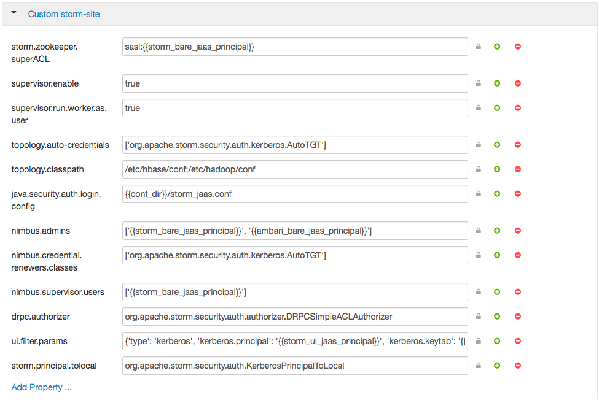

# Setting Up Kerberos in Vagrant Full Dev
**Note:** These are manual instructions for Kerberizing Metron Storm topologies from Kafka to Kafka. This does not cover the Ambari MPack, sensor connections, or MAAS.

1. Build full dev and ssh into the machine
  ```
cd incubator-metron/metron-deployment/vagrant/full-dev-platform
vagrant up
vagrant ssh
  ```

2. Export env vars. Replace *node1* with the appropriate hosts if running anywhere other than full-dev Vagrant.
  ```
# execute as root
sudo su -
export ZOOKEEPER=node1
export BROKERLIST=node1
export HDP_HOME="/usr/hdp/current"
export METRON_VERSION="0.3.1"
export METRON_HOME="/usr/metron/${METRON_VERSION}"
  ```

3. Stop all topologies - we will  restart them again once Kerberos has been enabled.
  ```
for topology in bro snort enrichment indexing; do storm kill $topology; done
  ```

4. Setup Kerberos
  ```
# Note: if you copy/paste this full set of commands, the kdb5_util command will not run as expected, so run the commands individually to ensure they all execute
# set 'node1' to the correct host for your kdc
yum -y install krb5-server krb5-libs krb5-workstation
sed -i 's/kerberos.example.com/node1/g' /etc/krb5.conf
cp /etc/krb5.conf /var/lib/ambari-server/resources/scripts
# This step takes a moment. It creates the kerberos database.
kdb5_util create -s
/etc/rc.d/init.d/krb5kdc start
/etc/rc.d/init.d/kadmin start
chkconfig krb5kdc on
chkconfig kadmin on
  ```

5. Setup the admin and metron user principals. You'll kinit as the metron user when running topologies. Make sure to remember the passwords.
  ```
kadmin.local -q "addprinc admin/admin"
kadmin.local -q "addprinc metron"
  ```

6. Create the metron user HDFS home directory
  ```
sudo -u hdfs hdfs dfs -mkdir /user/metron && \
sudo -u hdfs hdfs dfs -chown metron:hdfs /user/metron && \
sudo -u hdfs hdfs dfs -chmod 770 /user/metron
  ```

7. In Ambari, setup Storm to run with Kerberos and run worker jobs as the submitting user:

    a. Add the following properties to custom storm-site:

    ```
    topology.auto-credentials=['org.apache.storm.security.auth.kerberos.AutoTGT']
    nimbus.credential.renewers.classes=['org.apache.storm.security.auth.kerberos.AutoTGT']
    supervisor.run.worker.as.user=true
    ```

    b. In the Storm config section in Ambari, choose “Add Property” under custom storm-site:

    

    c. In the dialog window, choose the “bulk property add mode” toggle button and add the below values:

    

8. Kerberize the cluster via Ambari. More detailed documentation can be found [here](http://docs.hortonworks.com/HDPDocuments/HDP2/HDP-2.5.3/bk_security/content/_enabling_kerberos_security_in_ambari.html).

    a. For this exercise, choose existing MIT KDC (this is what we setup and installed in the previous steps.)

    

    

    b. Setup Kerberos configuration. Realm is EXAMPLE.COM. The admin principal will end up as admin/admin@EXAMPLE.COM when testing the KDC. Use the password you entered during the step for adding the admin principal.

    

    c. Click through to “Start and Test Services.” Let the cluster spin up, but don't worry about starting up Metron via Ambari - we're going to run the parsers manually against the rest of the Hadoop cluster Kerberized. The wizard will fail at starting Metron, but this is OK. Click “continue.” When you’re finished, the custom storm-site should look similar to the following:

    

9. Setup Metron keytab
  ```
kadmin.local -q "ktadd -k metron.headless.keytab metron@EXAMPLE.COM" && \
cp metron.headless.keytab /etc/security/keytabs && \
chown metron:hadoop /etc/security/keytabs/metron.headless.keytab && \
chmod 440 /etc/security/keytabs/metron.headless.keytab
  ```

10. Kinit with the metron user
  ```
kinit -kt /etc/security/keytabs/metron.headless.keytab metron@EXAMPLE.COM
  ```

11. First create any additional Kafka topics you will need. We need to create the topics before adding the required ACLs. The current full dev installation will deploy bro, snort, enrichments, and indexing only. e.g.
  ```
${HDP_HOME}/kafka-broker/bin/kafka-topics.sh --zookeeper ${ZOOKEEPER}:2181 --create --topic yaf --partitions 1 --replication-factor 1
  ```

12. Setup Kafka ACLs for the topics
  ```
export KERB_USER=metron;
for topic in bro enrichments indexing snort; do
${HDP_HOME}/kafka-broker/bin/kafka-acls.sh --authorizer kafka.security.auth.SimpleAclAuthorizer --authorizer-properties zookeeper.connect=${ZOOKEEPER}:2181 --add --allow-principal User:${KERB_USER} --topic ${topic};
done;
  ```

13. Setup Kafka ACLs for the consumer groups
  ```
${HDP_HOME}/kafka-broker/bin/kafka-acls.sh --authorizer kafka.security.auth.SimpleAclAuthorizer --authorizer-properties zookeeper.connect=${ZOOKEEPER}:2181 --add --allow-principal User:${KERB_USER} --group bro_parser;
${HDP_HOME}/kafka-broker/bin/kafka-acls.sh --authorizer kafka.security.auth.SimpleAclAuthorizer --authorizer-properties zookeeper.connect=${ZOOKEEPER}:2181 --add --allow-principal User:${KERB_USER} --group snort_parser;
${HDP_HOME}/kafka-broker/bin/kafka-acls.sh --authorizer kafka.security.auth.SimpleAclAuthorizer --authorizer-properties zookeeper.connect=${ZOOKEEPER}:2181 --add --allow-principal User:${KERB_USER} --group yaf_parser;
${HDP_HOME}/kafka-broker/bin/kafka-acls.sh --authorizer kafka.security.auth.SimpleAclAuthorizer --authorizer-properties zookeeper.connect=${ZOOKEEPER}:2181 --add --allow-principal User:${KERB_USER} --group enrichments;
${HDP_HOME}/kafka-broker/bin/kafka-acls.sh --authorizer kafka.security.auth.SimpleAclAuthorizer --authorizer-properties zookeeper.connect=${ZOOKEEPER}:2181 --add --allow-principal User:${KERB_USER} --group indexing;
  ```

14. Add metron user to the Kafka cluster ACL
  ```
/usr/hdp/current/kafka-broker/bin/kafka-acls.sh --authorizer kafka.security.auth.SimpleAclAuthorizer --authorizer-properties zookeeper.connect=${ZOOKEEPER}:2181 --add --allow-principal User:${KERB_USER} --cluster kafka-cluster
  ```

15. We also need to grant permissions to the HBase tables. Kinit as the hbase user and add ACLs for metron.
  ```
kinit -kt /etc/security/keytabs/hbase.headless.keytab hbase-metron_cluster@EXAMPLE.COM
echo "grant 'metron', 'RW', 'threatintel'" | hbase shell
echo "grant 'metron', 'RW', 'enrichment'" | hbase shell
  ```

16. Create a “.storm” directory in the metron user’s home directory and switch to that directory.
  ```
su metron && cd ~/
mkdir .storm
cd .storm
  ```

17. Create a custom client jaas file. This should look identical to the Storm client jaas file located in /etc/storm/conf/client_jaas.conf except for the addition of a Client stanza. The Client stanza is used for Zookeeper. All quotes and semicolons are necessary.
  ```
[metron@node1 .storm]$ cat client_jaas.conf
StormClient {
   com.sun.security.auth.module.Krb5LoginModule required
   useTicketCache=true
   renewTicket=true
   serviceName="nimbus";
};
Client {
   com.sun.security.auth.module.Krb5LoginModule required
   useKeyTab=true
   keyTab="/etc/security/keytabs/metron.headless.keytab"
   storeKey=true
   useTicketCache=false
   serviceName="zookeeper"
   principal="metron@EXAMPLE.COM";
};
KafkaClient {
   com.sun.security.auth.module.Krb5LoginModule required
   useKeyTab=true
   keyTab="/etc/security/keytabs/metron.headless.keytab"
   storeKey=true
   useTicketCache=false
   serviceName="kafka"
   principal="metron@EXAMPLE.COM";
};
  ```

18. Create a storm.yaml with jaas file info. Set the array of nimbus hosts accordingly.
  ```
[metron@node1 .storm]$ cat storm.yaml
nimbus.seeds : ['node1']
java.security.auth.login.config : '/home/metron/.storm/client_jaas.conf'
storm.thrift.transport : 'org.apache.storm.security.auth.kerberos.KerberosSaslTransportPlugin'
  ```

19. Create an auxiliary storm configuration json file in the metron user’s home directory. Note the login config option in the file points to our custom client_jaas.conf.
  ```
cd /home/metron
[metron@node1 ~]$ cat storm-config.json
{
  "topology.worker.childopts" : "-Djava.security.auth.login.config=/home/metron/.storm/client_jaas.conf"
}
  ```

20. Setup enrichment and indexing.

    a. Modify enrichment.properties - `${METRON_HOME}/config/enrichment.properties`

    ```
    kafka.security.protocol=PLAINTEXTSASL
    topology.worker.childopts=-Djava.security.auth.login.config=/home/metron/.storm/client_jaas.conf
    ```

    b. Modify elasticsearch.properties - `${METRON_HOME}/config/elasticsearch.properties`

    ```
    kafka.security.protocol=PLAINTEXTSASL
    topology.worker.childopts=-Djava.security.auth.login.config=/home/metron/.storm/client_jaas.conf
    ```

21. Kinit with the metron user again
  ```
kinit -kt /etc/security/keytabs/metron.headless.keytab metron@EXAMPLE.COM
  ```

22. Restart the parser topologies. Be sure to pass in the new parameter, “-ksp” or “--kafka_security_protocol.” Run this from the metron home directory.
  ```
for parser in bro snort; do ${METRON_HOME}/bin/start_parser_topology.sh -z ${ZOOKEEPER}:2181 -s ${parser} -ksp SASL_PLAINTEXT -e storm-config.json; done
  ```

23. Now restart the enrichment and indexing topologies.
  ```
${METRON_HOME}/bin/start_enrichment_topology.sh
${METRON_HOME}/bin/start_elasticsearch_topology.sh
  ```

24. Push some sample data to one of the parser topics. E.g for yaf we took raw data from [incubator-metron/metron-platform/metron-integration-test/src/main/sample/data/yaf/raw/YafExampleOutput](../../metron-platform/metron-integration-test/src/main/sample/data/yaf/raw/YafExampleOutput)
  ```
cat sample-yaf.txt | ${HDP_HOME}/kafka-broker/bin/kafka-console-producer.sh --broker-list ${BROKERLIST}:6667 --security-protocol SASL_PLAINTEXT --topic yaf
  ```

25. Wait a few moments for data to flow through the system and then check for data in the Elasticsearch indexes. Replace yaf with whichever parser type you’ve chosen.
  ```
curl -XGET "${ZOOKEEPER}:9200/yaf*/_search"
curl -XGET "${ZOOKEEPER}:9200/yaf*/_count"
  ```

26. You should have data flowing from the parsers all the way through to the indexes. This completes the Kerberization instructions

### Other useful commands:
#### Kerberos
Unsure of your Kerberos principal associated with a keytab? There are a couple ways to get this. One is via the list of principals that Ambari provides via downloadable csv. If you didn’t download this list, you can also check the principal manually by running the following against the keytab.
```
klist -kt /etc/security/keytabs/<keytab-file-name>
```

E.g.
```
klist -kt /etc/security/keytabs/hbase.headless.keytab
Keytab name: FILE:/etc/security/keytabs/hbase.headless.keytab
KVNO Timestamp         Principal
---- ----------------- --------------------------------------------------------
   1 03/28/17 19:29:36 hbase-metron_cluster@EXAMPLE.COM
   1 03/28/17 19:29:36 hbase-metron_cluster@EXAMPLE.COM
   1 03/28/17 19:29:36 hbase-metron_cluster@EXAMPLE.COM
   1 03/28/17 19:29:36 hbase-metron_cluster@EXAMPLE.COM
   1 03/28/17 19:29:36 hbase-metron_cluster@EXAMPLE.COM
```

#### Model as a Service on Kerberos

MaaS works with kerberos, you have to remember to kinit with the metron
user.  There is one small issue out of the box (particularly on vagrant), you get an error like so
when running `$METRON_HOME/bin/maas_service.sh`:
```
Requested user metron is not whitelisted and has id 501,which is below the minimum allowed 1000.
```

In order to correct this, you should:
* Navigate to the Yarn configuration in Ambari
* Click on "Advanced"
* Scroll to "Advanced yarn-env"
* Adjust the "Minimum user ID for submitting job" config to 500 from 1000
* You should then restart Yarn to have the change take effect.

#### Kafka with Kerberos enabled

##### Write data to a topic with SASL
```
cat sample-yaf.txt | ${HDP_HOME}/kafka-broker/bin/kafka-console-producer.sh --broker-list ${BROKERLIST}:6667 --security-protocol PLAINTEXTSASL --topic yaf
```

##### View topic data from latest offset with SASL
```
${HDP_HOME}/kafka-broker/bin/kafka-console-consumer.sh --zookeeper ${ZOOKEEPER}:2181 --security-protocol PLAINTEXTSASL --topic yaf
```

#### References
* [https://github.com/apache/storm/blob/master/SECURITY.md](https://github.com/apache/storm/blob/master/SECURITY.md)
