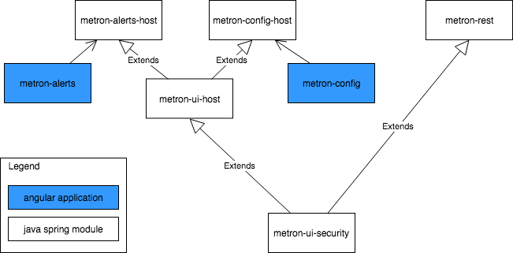
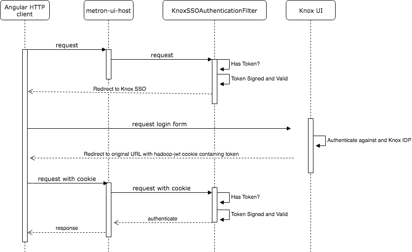
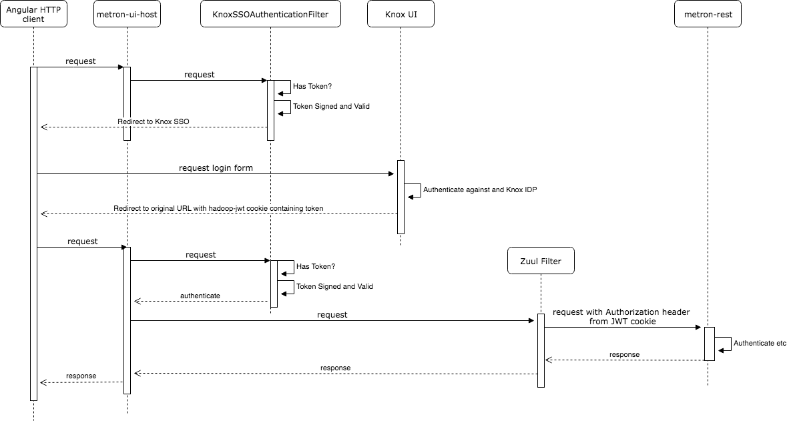

<!--
Licensed to the Apache Software Foundation (ASF) under one
or more contributor license agreements.  See the NOTICE file
distributed with this work for additional information
regarding copyright ownership.  The ASF licenses this file
to you under the Apache License, Version 2.0 (the
"License"); you may not use this file except in compliance
with the License.  You may obtain a copy of the License at

    http://www.apache.org/licenses/LICENSE-2.0

Unless required by applicable law or agreed to in writing, software
distributed under the License is distributed on an "AS IS" BASIS,
WITHOUT WARRANTIES OR CONDITIONS OF ANY KIND, either express or implied.
See the License for the specific language governing permissions and
limitations under the License.
-->
# Metron Interfaces

The Metron UIs are built as two Angular applications, one for a configuration use case and persona (metron-config), the other for a SOC analyst processing alerts (metron-alerts). The UIs should be secured with LDAP based authentication, and can be configured with SSL and KnoxSSO support as required.

There are a number of common utility packages, which are based on [Spring Boot](https://spring.io/projects/spring-boot).

The angular applications in metron-alerts and metron-config are built and packaged as jars.

metron-ui-security is the most basic, and contains security configruation beans for the spring applications, which supports a common approach to authentication across each unit.

metron-rest is the primary backend API host of for the metron front ends. It is a Spring Boot application, which incorportates metron-ui-security.

metron-ui-host is intended to provide simple static hosting for the angular applications, and security integration, as well as proxying via Zuul to connect to the metron-rest instance. This is an abstract application, while the concrete instances in metron-alerts-host and metron-config-hosts are very thin applications using this a base and pulling in the jar dependencies created by the angular build process for the static files.

## Authentication, LDAP and Knox SSO

LDAP authentication is configured through the spring yaml config method.

Authentication can also be handled via KnoxSSO. Knox sends a cookie (default name hadoop-jwt) to the users browser, which is sent to the corresponding host application (e.g. metron-alerts-host). The host application then forwards the JWT token it receives from the browser cookie as an Authorization bearer header to the metron-rest backend. Note that the host appliction can accept a JWT either from the cookie method used to passs tokens from Knox, or from the Authorization header in case application developers want to take the more secure approach of storing tokens in LocalStorage in browser and passing them in the header, instead of allowing the cookie.

The JWT token only provide a user name principal. LDAP configuration is required to map the principal to a group to attach Spring Security roles to the security context.

If KnoxSSO is configured un-authenticated requests will be redirected to the KnoxURL configured in yaml. If not configured, then the application will support HTTP Basic authentication using LDAP as a backend store for user credentials and will authenticate the user directly.

In the case of a simple static request, the process flow is as follows:

When the request from the front-end is for a REST api endpoint, it is proxied through Zuul as shown in this process:

