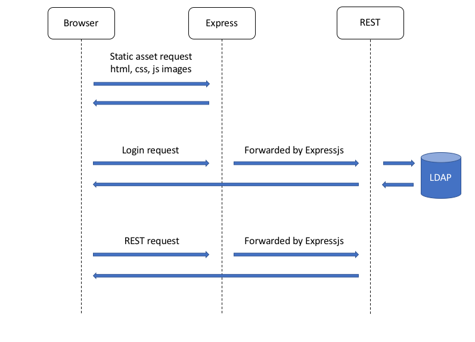
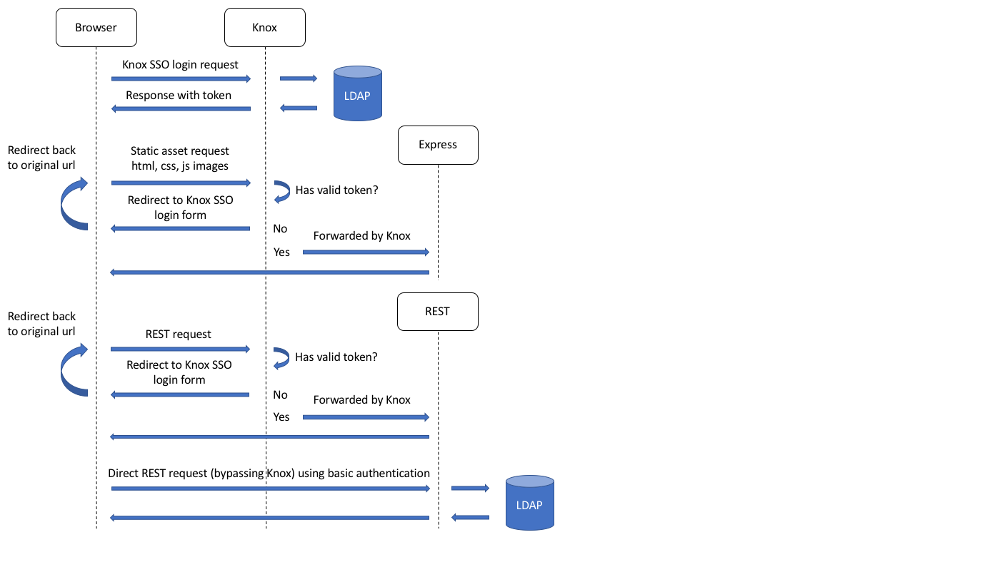

<!--
Licensed to the Apache Software Foundation (ASF) under one
or more contributor license agreements.  See the NOTICE file
distributed with this work for additional information
regarding copyright ownership.  The ASF licenses this file
to you under the Apache License, Version 2.0 (the
"License"); you may not use this file except in compliance
with the License.  You may obtain a copy of the License at

    http://www.apache.org/licenses/LICENSE-2.0

Unless required by applicable law or agreed to in writing, software
distributed under the License is distributed on an "AS IS" BASIS,
WITHOUT WARRANTIES OR CONDITIONS OF ANY KIND, either express or implied.
See the License for the specific language governing permissions and
limitations under the License.
-->
# Metron Interface

Metron interface contains code and assets to support the various web applications in Metron.  The existing modules are:

* metron-alerts : An Angular application that exposes a way to browse, filter and act on alerts.
* metron-config: An Angular application that allows an administrator to configure and maintain Metron.
* metron-rest: A Spring REST application that supports the UI and exposes Metron features through a REST/json interface.
* metron-rest-client: Model objects used for passing data back and forth in the REST application.  A Metron client would use these classes for de/serializing requests and responses.

## Architecture

The UIs and REST server are all run in separate web containers.  The UIs are served from separate [Express](https://expressjs.com/) servers that are configured to proxy REST requests
to the REST application.  Proxying REST requests satisfies the same-origin browser restriction because all requests go to Express, or the same origin.  

REST requests are handled by a [Spring Boot](https://spring.io/projects/spring-boot) application.  A [Swagger](https://swagger.io/) interface is available and served by the REST application.

### Security

The UIs depend on REST for authentication.  Credentials are passed with [Basic authentication](https://developer.mozilla.org/en-US/docs/Web/HTTP/Authentication) and only REST requests require
authentication, static assets are not secured.  Once authentication has been performed a session is established and a cookie is stored and used to authenticate subsequent requests.

### Request/Response Flow

The following diagram illustrates the flow of data for the various types of requests:

## Architecture with Knox

[Apache Knox](https://knox.apache.org/) is a "REST API and Application Gateway for the Apache Hadoop Ecosystem".  It can be enabled for Metron and provides several security benefits:

* All requests go through Knox so same-origin browser restrictions are not a concern.
* Knox, in combination with a firewall, can restrict traffic to always go through Knox.  This greatly reduces the security attack surface area of the UIs and REST application.
* Provides access to other common Apache Hadoop services
* Provides a single sign on experience between the UIs and REST application
* All requests can be protected and secured

We primarily use Knox's proxying and authentication services.  Knox acts as a reverse proxy for all UIs and the REST application.  

### Knox Security

With Knox enabled, Knox now handles authentication when accessing the UIs and REST together.  Basic authentication is still an option for making requests directly to the REST application.  Any request to the UIs must go through Knox first and contain the proper security token.  
If a valid token is not found, Knox will redirect to the Knox SSO login form.  Once a valid token is found, Knox will then redirect to the original url and the request will be forwarded on.  Accessing the REST application through Knox also follows this pattern.
The UIs make REST requests this way with Knox enabled since they no longer depend on Express to proxy requests.  The context path now determines which type of request it is rather than the host and port.  

REST still requires authentication so a filter is provided that can validate a Knox token using token properties and a Knox public key.  The REST application also supports Basic authentication.  Since both Knox and the REST application should use
the same authentication mechanism, LDAP authentication is required for the REST application.

### Knox Request/Response Flow

The following diagram illustrates the flow of data for the various types of requests when Knox is enabled:

Note how the flow diagrams for Static asset requests and Rest requests (through Knox) are identical.
