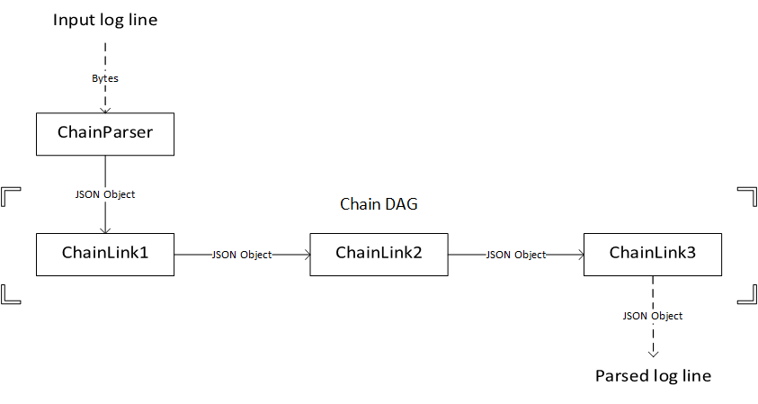
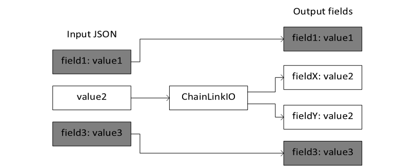

# Parsers for Metron

This repository contains parsers for Metron.

## Parser components

### ChainParser



The ChainParser first converts a raw text (the bytes of a raw text) to an initial JSON object with two fields:
- `original_string`: The original string object (which is equal to the raw text).
- `timestamp`: The current timestamp.

These fields can be overwritten by ChainLinks. The ChainParser validates the intermediate JSON objects and checks whether the `original_string` field and `timestamp` field are available after a ChainLink is executed.

The ChainParser points to a single ChainLink which is the root of the ChainLink DAG (Directed Acyclic Graph). A ChainLink points either to another ChainLink or is the final ChainLink. The resulting JSON object is the output of the ChainParser.

### ChainLink


A ChainLink has a JSON Object as input and produces (potentially a modified) JSON object as output.

#### Identity Link

The identity link passes on the given JSON object. No changes are made to the intermediate JSON object.

```json
{
    "chain": ["identity"],
        "parsers": {
            "identity": {
            "class": "org.apache.metron.parsers.contrib.links.fields.IdentityLink"
        }
    }
}
```

#### Normalize Field Link

The normalize field link applies the normalize function to all fields. The field "Hello World" is converted to "hello_world" for example. The transformations are found in the normalize function.

```json
{
    "chain": ["normalize_fields"],
    "parsers": {
        "normalize_fields": {
            "class": "org.apache.metron.parsers.contrib.links.fields.NormalizeFieldLink"
        }
    }
}
```

#### Rename Link

The rename link renames field names. The following configuration renames "field1" to "fieldX" and renames "field2" to "fieldY". The renames are specified by the "renames" argument where the keys are the original field names and the values are the new field names.

```json
{
    "chain": ["rename_fields"],
    "parsers": {
        "rename_fields": {
            "class": "org.apache.metron.parsers.contrib.links.fields.RenameLink",
            "renames": {
                "field1": "fieldX",
                "field2": "fieldY"
            }
        }
    }
}
```

#### Render link

The render link converts a template to a field and substitute variables in the template.

The template is a string and might contain references to variables by specifying the variable names between "{{" and "}}". The variables are substituted by the corresponding fields of the intermediate JSON object. The "variables" argument specifies which variables should be substituted in the template. The "output" specifies the field in which the rendered template should be stored.

The following example substitutes variables "var1" and "var2" in the given template:

```json
{
    "chain": ["render"],
    "parsers": {
        "render": {
            "class": "org.apache.metron.parsers.contrib.links.fields.RenderLink",
            "template": "Hello {{var1}} and {{var2}}",
            "variables": ["var1", "var2"],
            "output": "rendered_field"
        }
    }
}
```

#### Select link

The select link selects a fields and stores it into a special input field which is used by all ChainLinkIO parsers.

The following example selects "field1" and stores its value into the special input field. The field which is selected is specified by the "field" argument.

```json
{
    "chain": ["select"],
    "parsers": {
        "select": {
            "class": "org.apache.metron.parsers.contrib.links.fields.SelectLink",
            "field": "field1"
        }
    }
}
```

#### Trim value link

The trim value link trims whitespace for each value in the intermediate JSON object. So "  hello world  " is transformed into "hello world".

```json
{
    "chain": ["trim_values"],
    "parsers": {
        "trim_values": {
            "class": "org.apache.metron.parsers.contrib.links.fields.TrimValueLink"
        }
    }
}
```

#### Blacklist Link

The blacklist link removes specified fields from the input.

The following example removes "field1" and "field2" from the input. The fields are specified by the "fields" argument.

```json
{
    "chain": ["blacklist"],
    "parsers": {
        "blacklist": {
            "class": "org.apache.metron.parsers.contrib.links.fields.BlacklistLink",
            "fields": ["field1", "field2"]
        }
    }
}
```

#### Whitelist link

The whitelist link only allowed whitelisted fields and removes all other fields. Required fields (`original_string` and `timestamp`) are automatically whitelisted.

The following example whitelists "field1" and "field2" so these are the only fields left in the output. The fields are specified by the "fields" argument.

```json
{
    "chain": ["whitelist"],
    "parsers": {
        "trim_values": {
            "class": "org.apache.metron.parsers.contrib.links.fields.WhitelistLink",
            "fields": ["field1", "field2"]
        }
    }
}
```

### ChainLinkIO



ChainLinkIO is a specialized version of a ChainLink which uses one input field as input and produces a JSON object as output. This JSON object is then merged with the intermediate JSON object. Before a ChainLinkIO can be executed, a field must be selected and stored in the special input field. Instead of inserting a SelectLink before every ChainLinkIO, it is also possible to specify an "input" argument. The "input" argument is automatically transformed into a RenderLink and stores the result into the special input field. Note that it is possible to parse variables in the input, for example with `{"input": "{{var1}}"}`. It is also possible to use constants as input: `{"input": "constant string"}`. If no input field is specified, `original_string` is used by default.

#### JSON Decoder link

The JSON Decoder link decodes JSON found in the input field.

```json
{
    "chain": ["json_decoder"],
    "parsers": {
        "json_decoder": {
            "class": "org.apache.metron.parsers.contrib.links.io.JSONDecoderLink"
        }
    }
}
```

#### Key-Value link

The key-value link spits on pair-delimiters and on key-value delimiters. For example, take a look at the following string:

`KEY1=value1|KEY2=value2|KEY3=value3`

The pair delimiter would be `|` and the key-value delimiter is `=`. The following configuration is used for parsing the example:

```json
{
    "chain": ["keyvalue"],
    "parsers": {
        "keyvalue": {
            "class": "org.apache.metron.parsers.contrib.links.io.KeyValueLink",
            "pair_delimiter": "|",
            "key_value_delimiter": "=",
            "valid_key_characters": "A-Z"
        }
    }
}
```

The "pair_delimiter" argument specifies which pair delimiter is used. The "key_value_delimiter" argument specifies the key-value delimiter and the "valid_key_characters" argument specifies the characters of which a key exists. The last argument is a substring of the regular expression for detecting keys and is required for performance issues. The value "A-Z" refers to the fact that the keys consist only of uppercase characters.

#### Regex link

The regex link executes a regular expression on the input field and uses the first found result for the creation of the output object.

Take a look at the following example:

```json
{
    "chain": ["regex"],
    "parsers": {
        "regex": {
            "class": "org.apache.metron.parsers.contrib.links.io.RegexLink",
            "pattern": "(?i)(user|username)[=:](\\w+)",
            "selector": {
                "username": "2"
            }
        }
    }
}
```

This RegexLink searches for the pattern specified by the "pattern" field. The selector specifies the output fields. Here, the output field "username" contains the result of 2nd group of the regular expression. The "selector" argument is a mapping from output field names to the desired regular expression group which is used as value.

#### Split link

The split link splits the input on a given delimiter. Consider the following input:

`value1|value2|value3`

The split link can split on the `|` delimiter to obtain all the fields.

Take a look at the following example:

```json
{
    "chain": ["split"],
    "parsers": {
        "split": {
            "class": "org.apache.metron.parsers.contrib.links.io.SplitLink",
            "delimiter": "|",
            "selector": {
                "-1": "last_field",
                "0": "first_field",
                "1": "second_field"
            }
        }
    }
}
```

When applied on the given example, "last_field" contains "value3", "first_field" contains "value1" and "second_field" contains "value2". The "delimiter" argument specifies the delimiter to split on and the "selector" argument is a mapping from indices to fields. Negative indices might be used to traverse the items in negative order.

#### Timestamp link

The timestamp link uses regular expressions to search for datetime patterns in the input. Take a look at the following example.

```json
{
    "chain": ["parse_datetime"],
    "parsers": {
        "parse_datetime": {
            "class": "org.apache.metron.parsers.contrib.links.io.TimestampLink",
            "patterns": [
                ["([0-9]{4})-([0-9]+)-([0-9]+)T([0-9]+):([0-9]+):([0-9]+).([0-9]+)([+-]{1}[0-9]{1,2}[:]?[0-9]{2})", "yyyy MM dd HH mm ss SSSSSS Z", "newest"]
            ]
        }
    }
}
```

There is one argument "patterns" which specifies all the patterns. A pattern is a tuple consisting of multiple components:

- Regular expression.
- Matcher string.
- Ordering (optional).

Multiple patterns might be specified. The first matching pattern is used as output.

The regular expression is used for detecting a given datetime pattern in the input. Then, all the found groups are stored space-separated in an intermediate variable. The matcher string specifies the space-separated datetime components of the result. This is required so the timestamp parser can convert the datetime string to other formats. The ordering specifies which result must be used. The ordering `newest` is used for using the latest datetime string.

The timestamp parser generates the following fields:

- `datetime`: The formatted version of the datetime pattern found in the input. The format is specified in the `mapping` field.
- `mapping`: The mapping used for constructing the `datetime` field.
- `timezone_available`: Whether timezone information was found in the input.
- `original_timestamp`: The exact match which was found in the input.

## Development

### Creating a new ChainParser

A ChainParser mainly consists of configuration and uses the ChainParser base class. The configuration should be created under `test/resources/your_parser_name/config.json`. Take a look at different ChainParser configuration files for inspiration. Then, a test file need to be created (`test/java/nl/qsight/parserconfig/TestYourParserName`). It should contain the following contents:

```java
package org.apache.metron.parsers.contrib.parserconfig;

public class TestYourParserName extends TestParser {

    @Override
    public String getFolder() {
        return "your_parser_name";
    }
}
```

The only thing that need to be changed, is the `getFolder()` method, which should point to the name of the folder which was created.

The test will run over specified log lines. These log lines must be stored in `test/resources/your_parser_name/data_input` in which every line represents a log line. It will also need expected outputs. These are stored in `test/resources/your_parser_name/data_output`. Initially, you can put empty JSON objects for every input log line.

Then, you can run the test. It will show the duration for each of the links it consists of:

```text
===================================================================================
Start ChainParser:
Epoch:           0
Logline:         0
Input:           ...
Expected output: {...}
===================================================================================
Link:            org.apache.metron.parsers.contrib.links.io.JSONDecoderLink
Duration:        12.724098 ms
-----------------------------------------------------------------------------------
Link:            org.apache.metron.parsers.contrib.links.fields.RenderLink
Duration:        0.043077 ms
-----------------------------------------------------------------------------------
Link:            org.apache.metron.parsers.contrib.links.io.RegexLink
Duration:        1.275897 ms
-----------------------------------------------------------------------------------
Link:            org.apache.metron.parsers.contrib.links.fields.RenameLink
Duration:        0.041026 ms
-----------------------------------------------------------------------------------
Link:            org.apache.metron.parsers.contrib.links.fields.RenderLink
Duration:        0.03159 ms
-----------------------------------------------------------------------------------
Link:            org.apache.metron.parsers.contrib.links.io.TimestampLink
Duration:        2.045538 ms
-----------------------------------------------------------------------------------
Parser duration: 16.161226 ms
-----------------------------------------------------------------------------------
```

This is useful debug information and shows the bottlenecks of your parser.